# E-commerce Back End 
The challenge is to build the back end for an e-commerce site.

## description
This app needs a working Express.js API and configure it to use Sequelize to interact with a MySQL database. This application won’t be deployed so I will show a walkthrough video that demonstrates its functionality.
## Technologies
        Javascript
        Node.js
        Sequelize
        MySQL2
        Express
        Dotenv
## Installation
        step 1 :git clone https://github.com/AbelZemo/E-commerce-Back-End 
        step 2 : Both Node.js and MySQL must be installed on your computer.
        step 3 : Install dependencies using the below commands
        ( 
                npm init --y
                npm install express sequelize mysql2
        )
        step 4 : Open up MySQL shell and type this input (source db/schema.sql)
        step 5 : type this input (use ecommerce_db)
        step 6 : Then quit MySQL shell and input the following command in your terminal (npm run seed)
        step 7 : to start running application simply type this command 
        (
                npm start or node server.js
        )
        step 8 : Open up Insomnia core to GET, POST, PUT and DELETE from different routes.

## screenshots

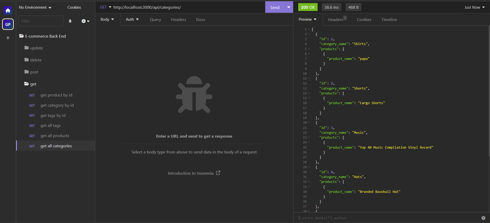
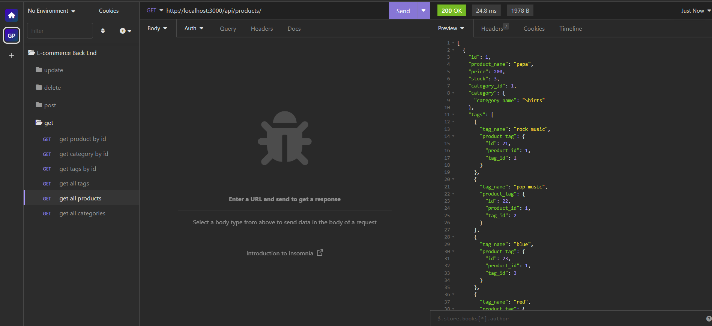
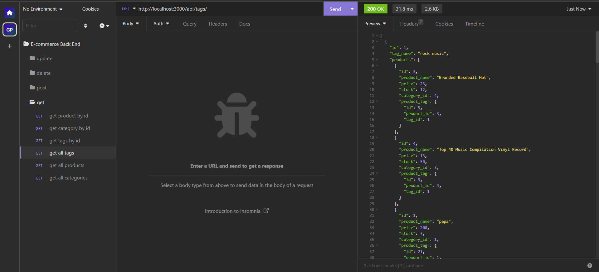
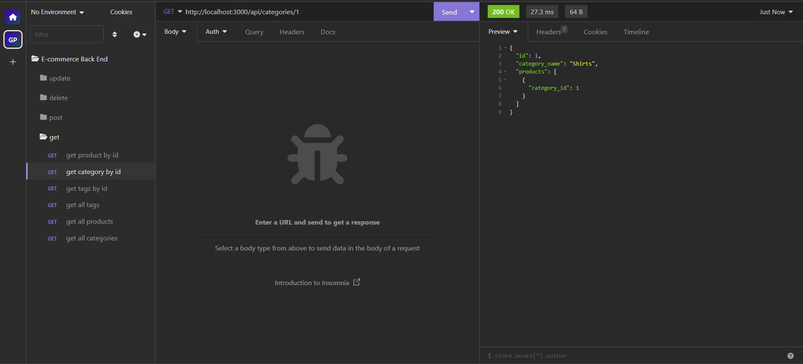
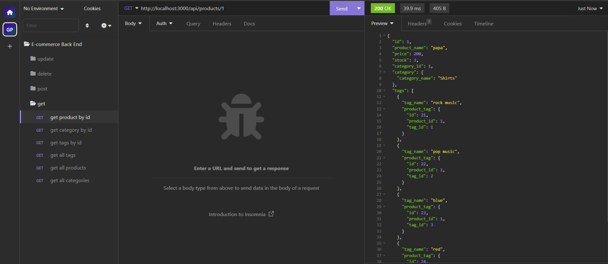
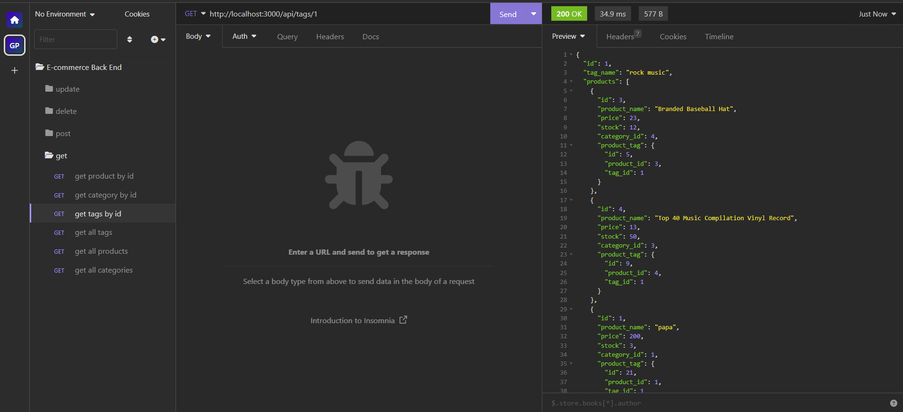
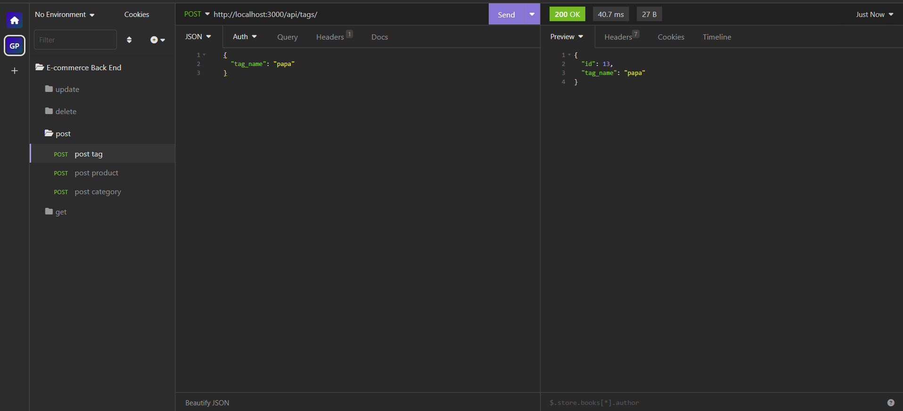
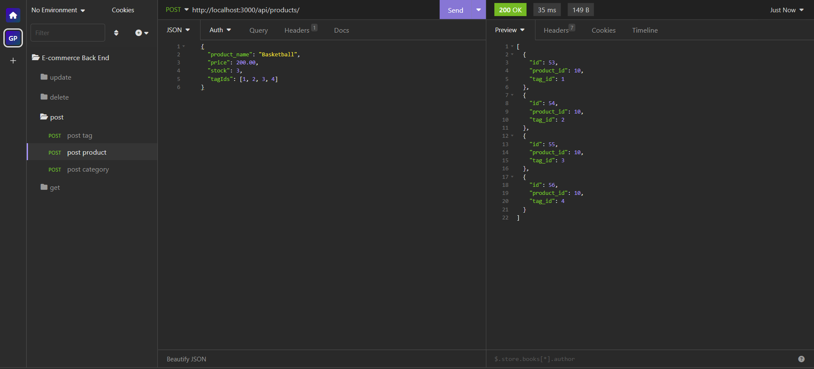
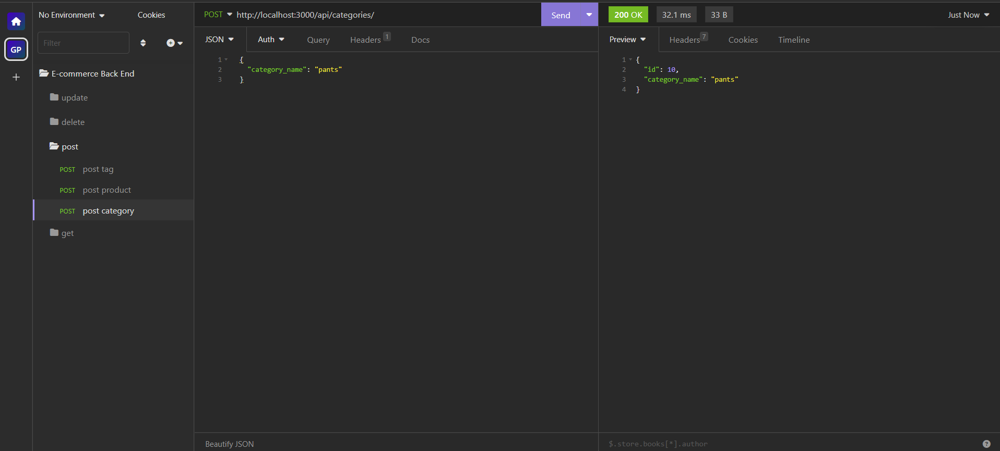
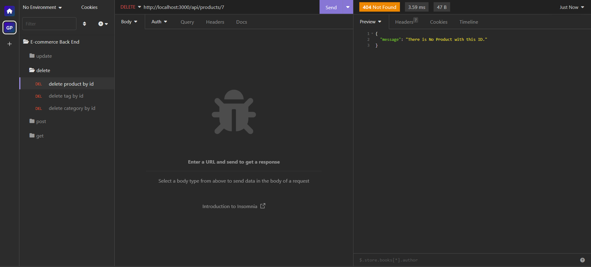
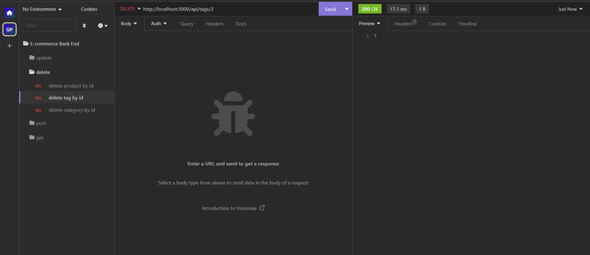
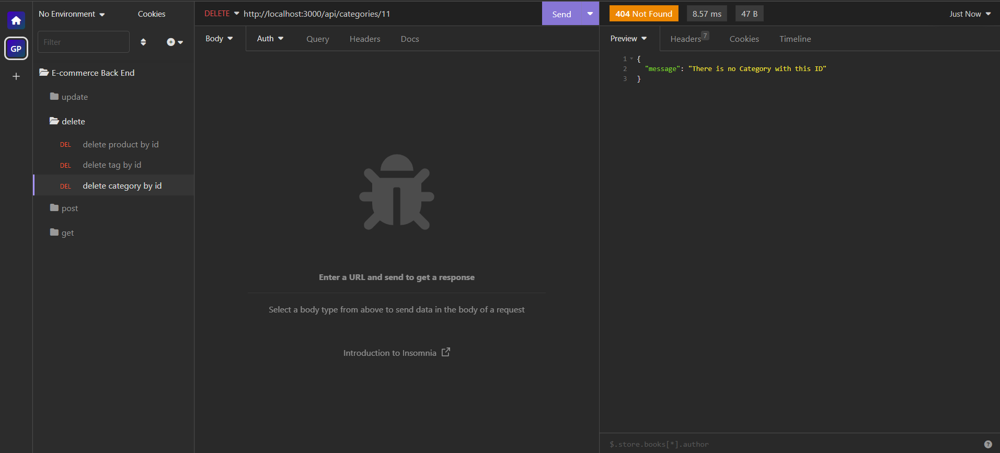
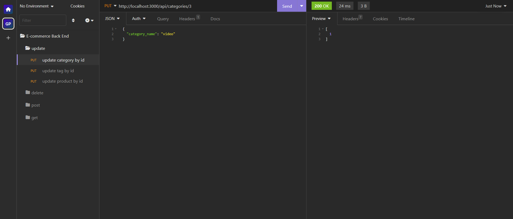
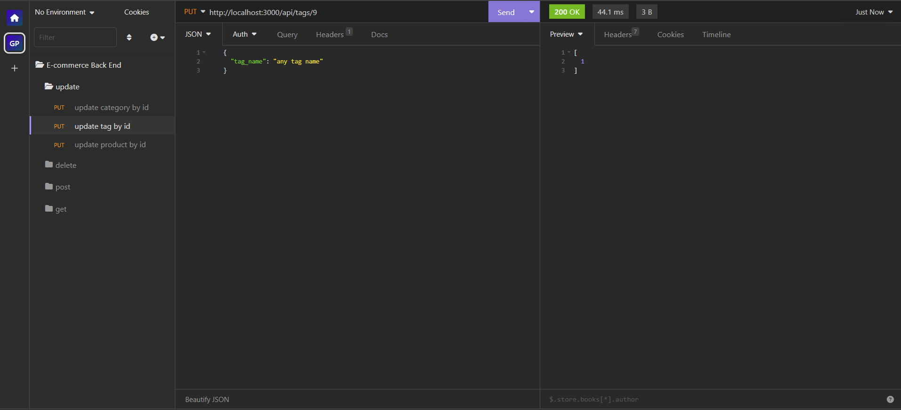
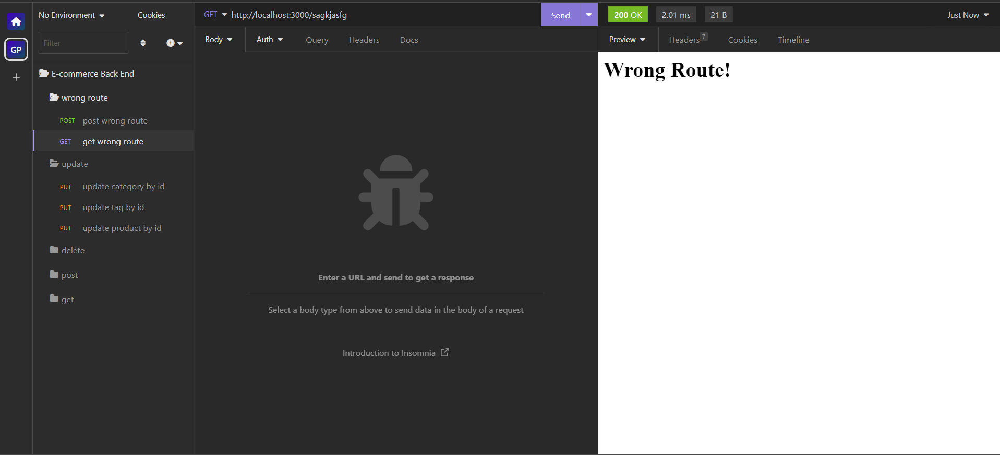
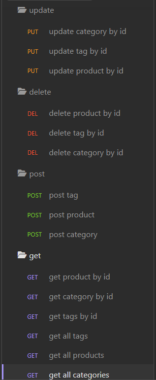

## Usage
The application is used to GET data for each route(categories, products, or tags) as well as create, update, and delete data in those routes.

## walkthrough video link

